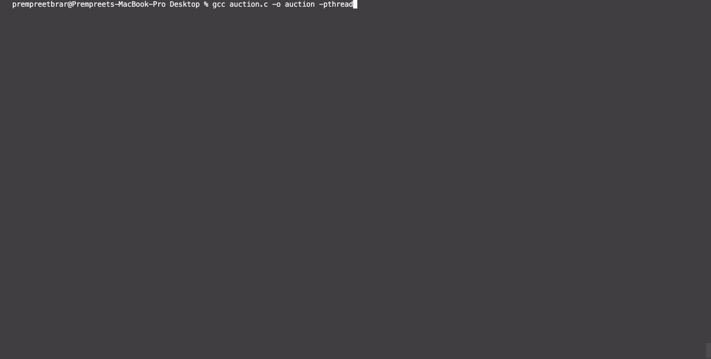

# Auction

A multithreaded auction program which simulates an auction using a thread for each bidder, displaying the live results of the auction; the winner is shown at the end of the auction, with ties broken based on which bidder submitted their bid faster.

&nbsp;
&nbsp;
&nbsp;


### If you are on MacOS/Linux

1. Ensure you have gcc installed by writing ```gcc -v``` in the terminal; **Note: on MacOS, it may show the clang or clang++ compilation tools when you write this. That will also work.** If you don't have gcc, install gcc by writing

```
export HOMEBREW_NO_ANALYTICS=1
brew update
brew upgrade
brew info gcc
brew install gcc
brew cleanup
```

2. Repeat step 1 to ensure the installation was successful.
3. To compile the code in the terminal, ensure you are in the directory containing auction.c, and write
```
gcc auction.c -o auction -pthread
```
4. To run the code in the terminal, ensure you are in the directory containing auction.c, and write
```
./auction
```

&nbsp;
&nbsp;
&nbsp;


### If you are on Windows

1. **Note: gcc installation on Windows is cumbersome.** Check if you have gcc installed by writing ```gcc --version``` in the command prompt. If you don't have gcc installed, copy and paste the code from auction.c in this [online IDE](https://replit.com/languages/C). The online IDE allows you to execute your code with the click of a button, so the following steps are for those who are running the code in their PC's terminal.
2. The online IDE allows you to execute your code with the click of a button. If you are compiling this in your PC's terminal, ensure you are in the directory containing auction.c, and write
```
gcc auction.c -o auction -pthread
```
3. To run the code in the terminal, ensure you are in the directory containing auction.c, and write
```
./auction
```


&nbsp;
&nbsp;
&nbsp;

## Rules:
- The user enters the number of bidders in the auction (the maximum is 100, although this number is arbitrary and can be changed to any other larger or smaller maximum).
- The user enters an upper bound (n) on the number of bids a bidder can make; if the bidder has made n-1 bids without committing a bid, they are forced to commit their last bid.
- The user also enters the maximum time a bidder can take for a single bid, along with the maximum value a bidder can bid.
- The results of the auction are displayed after it is finished in descending order; ties are broken by smallest bid time.
 
## How it Works:
- Each bidder thread enters several bids (bid value is chosen randomly), and every time a bid is made, there is a 50/50 chance of it being committed. Once a bid is committed, the bidder thread terminates.
- You can see the progress of each bidder as an arrow (these arrows move as the bidder's change their bids); an arrow terminated with a > indicates that the bidder has not yet made a final bid, while an arrow terminated with a * indicates that the bidder has made their final bid.
- The auction winner is the bidder with the highest bid value, with ties broken by smallest bid time.



## Limitations/Design Choices


